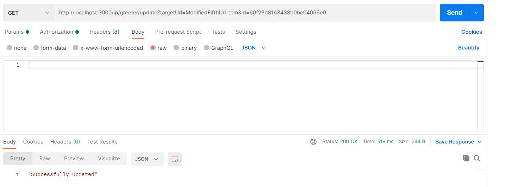
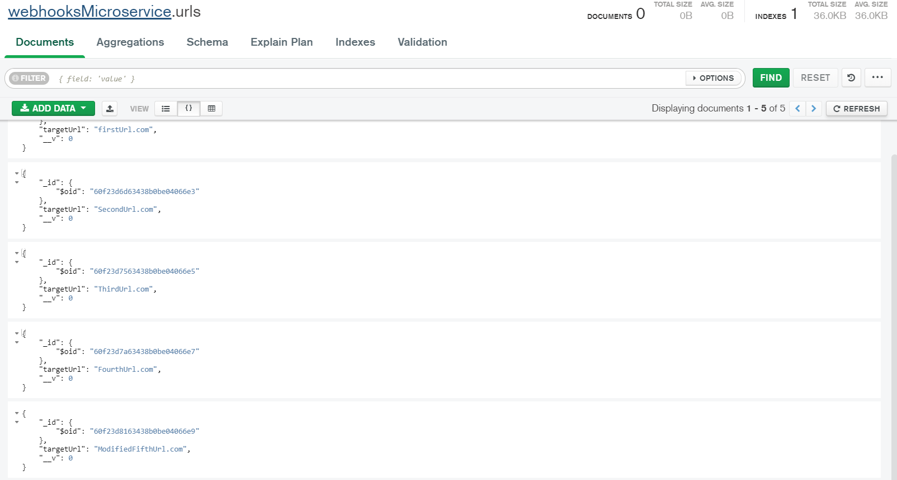

# moleculer-demo
This is a [Moleculer](https://moleculer.services/)-based microservices project. Generated with the [Moleculer CLI](https://moleculer.services/docs/0.14/moleculer-cli.html).

## Usage
Start the project with `npm run dev` command. 
After starting, open the http://localhost:3000/ URL in your browser. 
On the welcome page you can test the generated services via API Gateway and check the nodes & services.

In the terminal, try the following commands:
- `nodes` - List all connected nodes.
- `actions` - List all registered service actions.
- `call greeter.list` - Call the `greeter.list` action.
- `call greeter.register --targetUrl http://localhost:5000` - Call the `greeter.register` action with the `targetUrl` parameter.
- `call greeter.update --targetUrl http://localhost:5000/todo --id 60f23d2463438b0be04066e1` - Call the `greeter.update` action with the `targetUrl` and `id` parameter.
- `call greeter.delete --id 60f23d2463438b0be04066e1` - Call the `greeter.delete` action with the `id` parameter.
- `call ip.trigger --ipAddress 10.10.10.10` - Call the `ip.trigger` action with the `ipAddress` parameter.

## Database
Local MongoDB storage is used for storing data
`mongodb://localhost:27017/webhooksMicroservice`

## Services
- **api**: API Gateway services
- **greeter**: Sample service with `register`,`update`,`list` and `delete` actions.
- **ip**: Sample service with `trigger` action.

## Mixins
- **db.mixin**: Database access mixin for services. Based on [moleculer-db](https://github.com/moleculerjs/moleculer-db#readme)

## Useful links

* Moleculer website: https://moleculer.services/
* Moleculer Documentation: https://moleculer.services/docs/0.14/

## NPM scripts

- `npm run dev`: Start development mode (load all services locally with hot-reload & REPL)
- `npm run start`: Start production mode (set `SERVICES` env variable to load certain services)
- `npm run cli`: Start a CLI and connect to production. Don't forget to set production namespace with `--ns` argument in script
- `npm run lint`: Run ESLint
- `npm run ci`: Run continuous test mode with watching
- `npm test`: Run tests & generate coverage report
- `npm run dc:up`: Start the stack with Docker Compose
- `npm run dc:down`: Stop the stack with Docker Compose

## Screenshots of output

### Authorized users only access

### Unauthorized users has no access

### No Records initially in Database

### No Records initially

### Register target url in database

### List target url from database

### Update target url

### Update target url database

### Delete target url 

### Delete target url from database

### Mongo Database screenshot

### Trigger action

### localhost:5000 receiving post request made by my application (localhost:3000) - trigger action

